# 교육행정 질문답변 말뭉치·RAG 기반 설계

- 작성일: 2026-08-08
- 상태: 사용자 방향 승인 후 문서화
- 대상 저장소: `education-admin-launcher`
- 대상 자료: 서울특별시교육청 교육행정지원시스템 질문·답변 사례집 2020~2025년판 6권
- 이번 설계 범위: 원문 수집, 추출·OCR, 사례 구조화, 품질 검증, 검색용 색인, 검색 평가

## 1. 결정 요약

기존 4MB 단일 HTML은 화면 시제품과 기존 도구 동작을 보존하는 참고 구현으로 동결한다. HTML에 내장된 2,418건은 새 시스템의 원천 데이터로 사용하지 않는다. 새 말뭉치는 PDF 6권에서 다시 생성하고, 모든 사례가 원문 페이지와 추출 이력을 추적할 수 있어야 한다.

핵심 결정은 다음과 같다.

1. 고정 글자 수 문서 청킹 대신 질문답변 또는 감사사례 한 건을 부모 단위로 사용한다.
2. 2020~2022년판은 원문 텍스트와 좌표를 추출하고, 2023~2025년판은 전체 페이지 OCR을 수행한다.
3. 원문, 기계 추출문, 정제문, 수동 교정문을 덮어쓰지 않고 계층적으로 보존한다.
4. 사례 경계, 질문, 답변, 근거, 페이지가 검증되기 전에는 임베딩과 답변용 색인에 포함하지 않는다.
5. 검색은 처음부터 한글 문자 기반 lexical 검색과 dense 검색을 함께 수행하고 RRF로 결합한다.
6. Qdrant는 dense 벡터와 검색 메타데이터에 사용하고, SQLite WAL은 정규 말뭉치, lexical 색인, 실행 이력, 평가 결과에 사용한다.
7. 제작진 크레딧, 목차, 편 표지, 빈 면은 일반 사례 검색 색인에서 제외한다.
8. 자료의 공개·재배포 근거가 확인되지 않은 문서는 직원 제한 파일럿 밖으로 배포하지 않는다.
9. 이 단계에는 생성형 AI, 직원 인증, 공개 웹 배포, 계산기 개편을 포함하지 않는다.

## 2. 배경과 현재 상태

기존 앱에는 2020~2025년 사례 2,418건이 `window.APP` 한 줄에 포함돼 있다.

| 항목 | 현재 값 | 문제 |
|---|---:|---|
| 전체 사례 | 2,418건 | 원본 PDF와의 재현 가능한 계보가 없음 |
| 질의응답 | 2,001건 | 질문·답변·근거가 독립 필드가 아님 |
| 감사사례 | 411건 | 준식별 정보와 일반 사례의 검색 정책이 같음 |
| 참고자료 | 6건 | 문서와 사례 유형의 구분이 약함 |
| 법령 필드가 빈 사례 | 1,565건, 64.7% | 2021~2024년은 전 건 비어 있음 |
| 본문 1,500자 이상 | 108건 | 모두 1,502자에서 잘린 흔적이 있음 |
| 매우 짧은 본문 | 24건 | 잘못된 경계 또는 OCR 손상 가능성 |
| 실제 작동 도구 | 7개 | 데이터·규칙 버전이 코드와 결합됨 |
| 미리보기 도구 | 10개 | 실제 기능처럼 오인될 수 있음 |

현재 검색은 공백과 구두점으로 나눈 토큰이 제목·분류·본문에 포함되는지만 계산한다. IDF, 구문, 한글 띄어쓰기 변형, 법령명·조문·금액의 정확 일치, 연도 간 대체·상충 관계가 없다. AI 호출에는 상위 6개 사례의 본문 앞 600자만 전달돼 답변 또는 법적 근거가 잘릴 수 있다.

이 설계는 화면 개편보다 말뭉치 정확성과 검색 재현성을 먼저 해결한다.

## 3. 목표와 비목표

### 3.1 목표

- PDF 6권을 동일한 명령으로 다시 처리해 같은 정규 말뭉치를 생성한다.
- 각 사례의 질문, 답변, 사실관계, 법적 근거, 참고자료, 원문 페이지를 분리한다.
- PDF 물리 페이지와 책자에 인쇄된 페이지 번호를 모두 보존한다.
- 모든 정제와 수동 교정이 원문까지 역추적되도록 한다.
- OCR 품질이 낮거나 경계가 불명확한 사례를 자동 답변 대상에서 제외한다.
- 한글 행정 용어, 법령명, 조문, 금액, 날짜, 오타·띄어쓰기 변형을 찾을 수 있는 검색 기반을 만든다.
- 200개 골드 질문으로 수집·검색 품질을 반복 측정한다.
- 후속 직원용 검색 UI와 근거 답변 서비스가 사용할 안정적인 검색 계약을 제공한다.

### 3.2 비목표

- ChatGPT OAuth 또는 Platform API를 통한 답변 생성
- 직원 SSO, 회원·권한 관리, 공개 익명 API
- DOCX, HWPX, HWP, HTML, CSV, JSON, 관계형 DB용 범용 수집기
- 대화 기억, 파일 업로드, 외부 웹 검색
- 기존 계산기 7개와 미리보기 도구 10개의 구현 변경
- 로컬 LLM, reranker, Valkey, 분산 작업 큐

후속 기능은 이 말뭉치와 검색 평가가 합격한 후 각각 별도 설계와 구현계획으로 진행한다.

## 4. 원본 자료 인벤토리

| 판 | PDF 쪽수 | 추출 방식 | 주요 품질 특성 | 페이지 표기 |
|---|---:|---|---|---|
| 2020 | 302 | 네이티브 텍스트·좌표 | 홀수면 세로 내비게이션이 본문에 섞일 수 있음 | 본문에서 인쇄 쪽 = PDF 쪽 - 6 |
| 2021 | 383 | 네이티브 텍스트·좌표 | 상위 목차 페이지 숫자 겹침, 상세 목차는 정상 | PDF 쪽과 인쇄 쪽이 대체로 같음 |
| 2022 | 386 | 네이티브 텍스트·좌표 | 질문·답변과 참고자료가 다음 쪽으로 이어짐 | PDF 쪽과 인쇄 쪽이 대체로 같음 |
| 2023 | 168 | 전체 페이지 OCR | 텍스트 레이어 없음, 약 96dpi 페이지 이미지 | 본문에서 인쇄 쪽 = PDF 쪽 - 6 |
| 2024 | 324 | 전체 페이지 OCR | 텍스트 레이어 없음, 주된 이미지 150dpi | 번호가 있는 본문은 PDF 쪽과 인쇄 쪽이 같음 |
| 2025 | 314 | 전체 페이지 OCR | 텍스트 레이어 없음, 주된 이미지 300dpi | 번호가 있는 본문은 PDF 쪽과 인쇄 쪽이 같음 |

각 원본은 다음 정보를 manifest에 기록한다.

- 안정적인 `doc_id`
- 파일명과 SHA-256
- 공식 제목, 판 연도, 발행처, 등록번호
- PDF 페이지 수와 페이지 크기
- 자료 수록 기간이 확인되는 경우 시작일과 종료일
- 로컬 source volume에서의 상대 경로
- 공식 공개 URL 확인 상태
- 공개·재배포 승인 상태
- 추출 방식과 원본 이미지 DPI
- 페이지 번호 변환 규칙

공식 URL과 재배포 근거가 확인되지 않은 자료는 `redistribution_status=unverified`로 저장하고 직원 제한 파일럿 외부에서는 제공하지 않는다.

## 5. 전체 아키텍처

```mermaid
flowchart LR
    PDF["원본 PDF 6권\n읽기 전용"] --> MANIFEST["Source manifest\n해시·페이지·정책"]
    MANIFEST --> EXTRACT["연도별 추출기\nNative 또는 OCR"]
    EXTRACT --> RAW["원시 페이지·라인\n텍스트+bbox+confidence"]
    RAW --> PARSE["사례 경계 파서\nQ/A·감사·법규 분리"]
    PARSE --> NORMALIZE["정규화·PII 분류\n원문 보존"]
    NORMALIZE --> REVIEW["품질 게이트\n자동검사+사람 검수"]
    REVIEW --> CANON["Canonical SQLite/JSONL\ndocuments·cases·chunks"]
    CANON --> LEX["한글 문자 lexical 색인"]
    CANON --> EMBED["로컬 dense 임베딩"]
    EMBED --> QDRANT["Qdrant collection"]
    LEX --> RETRIEVE["Hybrid retrieval + RRF"]
    QDRANT --> RETRIEVE
    RETRIEVE --> EVAL["200문항 회귀 평가"]
```



### 5.1 컴포넌트 경계

| 컴포넌트 | 책임 | 입력 | 출력 |
|---|---|---|---|
| manifest 검사기 | 원본 식별·변경 탐지 | source volume | 검증된 문서 manifest |
| 페이지 추출기 | 텍스트·라인·좌표 획득 | PDF와 문서 정책 | 원시 page JSONL |
| 사례 파서 | 레이아웃을 사례 구조로 변환 | page JSONL | 후보 case JSONL |
| 정규화기 | 공백·유니코드·반복요소 정리 | 후보 case | 원문·정제문 쌍 |
| 품질 검사기 | 경계·필수필드·PII·페이지 검사 | 정제 후보 | 승인 또는 격리 판정 |
| 말뭉치 빌더 | 관계·청크·법령 참조 생성 | 승인 사례 | canonical DB/JSONL |
| 색인 빌더 | lexical·dense 색인 생성 | canonical corpus | SQLite FTS와 Qdrant collection |
| 평가기 | 수집·검색 지표 산출 | 골드셋과 색인 | 버전별 평가 보고서 |

각 컴포넌트는 파일 또는 명시된 데이터 계약으로 연결한다. 한 컴포넌트의 내부 라이브러리를 바꿔도 다음 컴포넌트의 입력 스키마가 유지되도록 한다.

## 6. 저장소와 산출물 구조

원본 PDF와 대형 생성 산출물은 Git에 넣지 않는다. 저장소에는 코드, 스키마, manifest, 작은 테스트 fixture, 평가 질문과 보고서 요약만 커밋한다.

```text
data/
├── manifests/
│   └── sen_qa_sources.json
├── schemas/
│   ├── document.schema.json
│   ├── case.schema.json
│   ├── chunk.schema.json
│   └── search-result.schema.json
└── eval/
    ├── retrieval-dev.jsonl
    └── retrieval-blind.jsonl

src/
├── ingestion/
│   ├── manifest.py
│   ├── extract_native.py
│   ├── extract_ocr.py
│   ├── parse_2020.py
│   ├── parse_2021_2022.py
│   ├── parse_2023.py
│   ├── parse_2024_2025.py
│   ├── normalize.py
│   ├── privacy.py
│   └── quality.py
├── corpus/
│   ├── models.py
│   ├── ids.py
│   ├── relations.py
│   └── build.py
├── retrieval/
│   ├── lexical.py
│   ├── dense.py
│   ├── fusion.py
│   └── service.py
└── evaluation/
    ├── ingestion_metrics.py
    └── retrieval_metrics.py

tests/
├── fixtures/
│   ├── native-pages/
│   └── ocr-pages/
├── ingestion/
├── corpus/
├── retrieval/
└── evaluation/

artifacts/                 # Git 제외, 로컬/NAS 데이터 볼륨
├── raw-pages/
├── parsed-cases/
├── canonical/
├── review-queue/
├── indexes/
└── reports/
```

## 7. 정규 데이터 모델

### 7.1 Document

```json
{
  "doc_id": "sen-qa-2025-v1",
  "edition_year": 2025,
  "title": "2025년 교육행정지원시스템 질문·답변 사례집",
  "publisher": "서울특별시교육청",
  "registration_no": "서울교육 2025-109",
  "source_period_start": "2024-07-01",
  "source_period_end": "2025-06-30",
  "source_filename": "2025-questions-answers.pdf",
  "sha256": "64자리 소문자 SHA-256",
  "pdf_page_count": 314,
  "extraction_method": "ocr",
  "source_dpi": 300,
  "public_url": null,
  "redistribution_status": "unverified",
  "access_level": "staff",
  "page_numbering_rule": "body_same_as_pdf",
  "ingestion_version": "corpus-v1"
}
```

`public_url=null`은 URL이 없다는 뜻이 아니라 공식 URL이 검증되지 않았음을 뜻한다. 검증 전에는 사용자에게 임의 URL을 제공하지 않는다.

### 7.2 Case

```json
{
  "case_id": "senqa-2025-contract-general-001",
  "legacy_ids": ["CT-001"],
  "doc_id": "sen-qa-2025-v1",
  "case_type": "qa",
  "domain": "계약",
  "part": "계약 일반",
  "subtopic": "계약방법 및 체결",
  "case_no": "1",
  "title_raw": "2단계 입찰",
  "title_normalized": "2단계 입찰",
  "question": "2단계 입찰 제안서 평가위원회 구성에 관한 근거 및 지침 문의",
  "answer": "정규화된 답변 본문",
  "facts": null,
  "basis_text": "근거와 참고자료 본문",
  "law_ref_ids": ["lawref-2025-000001"],
  "source_spans": [
    {
      "pdf_page_index": 13,
      "page_label": "13",
      "bbox": [126, 341, 1064, 1498],
      "text_sha256": "64자리 소문자 SHA-256"
    }
  ],
  "extraction_source": "ocr",
  "extraction_confidence": 0.98,
  "critical_field_review": "verified",
  "pii_class": "none",
  "anonymization_status": "not_required",
  "currency_status": "historical_reference",
  "search_eligible": true,
  "answer_eligible": true,
  "review_status": "approved"
}
```

감사사례는 `case_type=audit`를 사용하고 `facts`에 익명화된 사실관계를 저장한다. 법규 색인은 `case_type=law_index`, 제작진은 `case_type=credits`를 사용한다. `search_eligible`은 직원 검색 결과에 포함할 수 있는지를, `answer_eligible`은 외부 생성 모델의 근거로 전달할 수 있는지를 각각 제어한다. 제작진과 `restricted` 자료는 두 값을 모두 `false`로 고정한다.

### 7.3 Chunk

```json
{
  "chunk_id": "senqa-2025-contract-general-001-question-01",
  "case_id": "senqa-2025-contract-general-001",
  "role": "question",
  "sequence": 1,
  "text": "제목, 질문, 대상, 분야를 결합한 검색용 문장",
  "embedding_text": "계약 > 계약 일반 > 계약방법 및 체결\n2단계 입찰\n질문 본문",
  "source_span_indexes": [0],
  "token_count": 92,
  "quality_flags": [],
  "search_eligible": true,
  "answer_eligible": true
}
```

`role`은 `question`, `answer`, `basis`, `facts`, `table` 중 하나다. 청크는 부모 사례나 원문 페이지를 넘어서지 않는다.

### 7.4 LawRef

`LawRef`는 다음을 독립 필드로 저장한다.

- 표시된 법령·지침명
- 문서에 적힌 약칭
- 조·항·호
- 문서가 인용한 시행일
- 원문 인용문
- 원문 페이지와 bbox
- 파싱 신뢰도와 검수 상태

법령명을 현재 법령명으로 자동 치환하지 않는다. 문서가 인용한 당시 표기와 후속 최신성 검증 결과를 별도 필드로 유지한다.

### 7.5 CaseRelation

연도 간 유사 사례를 합쳐 덮어쓰지 않는다. 다음 관계를 사용한다.

- `related`: 같은 주제지만 대상·사실이 다름
- `duplicate`: 의미와 근거가 실질적으로 같음
- `supersedes`: 새 사례가 이전 사례를 명시적으로 대체함
- `conflicts`: 결론 또는 적용 조건이 상충함

`supersedes`는 판 연도가 최신이라는 이유만으로 자동 생성하지 않는다. 법령 시행일, 적용 대상, 답변 내용과 사람 검수를 근거로 승인한다.

### 7.6 IngestionRun

각 실행은 다음을 기록한다.

- 실행 ID와 시작·종료 시각
- release ID
- 소스 manifest 버전과 원본 SHA-256
- 추출기·OCR 엔진·모델·컨테이너 이미지 버전
- 정규화·파서·스키마 버전
- 문서별 성공·격리·실패 페이지 수
- 생성·변경·삭제된 사례 ID
- 품질 지표와 승인자

동일 원본과 동일 설정을 다시 처리한 결과의 canonical content hash가 달라지면 빌드는 실패한다.

release ID는 `corpus-{UTC YYYYMMDDHHMMSS}-{git sha 8자}` 형식이다. SQLite, JSONL, Qdrant collection, 평가 보고서와 snapshot은 같은 release ID를 사용한다.

`review_status`는 `machine_extracted`, `needs_review`, `search_approved`, `approved`, `rejected`의 명시적 상태를 사용한다. `search_approved`는 직원 검색에만 사용할 수 있고, `approved`는 검색과 답변 근거에 사용할 수 있다. 자동 검사를 통과해도 사람 검수가 필수인 품질군은 두 승인 상태로 자동 전환하지 않는다. `machine_extracted`, `needs_review`, `rejected` 상태는 `search_eligible=false`, `answer_eligible=false`다.

## 8. 안정적인 식별자

`case_id`는 `senqa-{edition_year}-{domain_slug}-{part_slug}-{case_no}` 형식으로 만든다. 같은 편에서 번호가 중복되면 원문 시작 페이지와 제목 해시 8자를 붙인다. 한 번 발급한 ID는 삭제 후에도 재사용하지 않는다.

현재 HTML의 ID는 규칙이 연도별로 다르므로 `legacy_ids`에만 저장한다. 레거시 ID 매핑은 별도 JSON으로 생성하고 새 ID의 유일성·역매핑 가능성을 테스트한다.

## 9. 추출과 OCR 정책

### 9.1 공통 원칙

1. source volume은 읽기 전용으로 마운트한다.
2. 처리 전 파일 SHA-256과 페이지 수를 manifest와 비교한다.
3. PDF 페이지를 1부터 시작하는 `pdf_page_index`로 기록한다.
4. 페이지마다 텍스트 블록, 라인, bbox, confidence와 렌더 이미지 해시를 저장한다.
5. 페이지 추출 실패를 빈 문자열로 대체하지 않고 해당 페이지를 격리한다.
6. 헤더·푸터·세로 탭 제거 전 원시 페이지 결과를 보존한다.

### 9.2 2020~2022년 네이티브 추출

- PyMuPDF의 block·line·span 좌표를 사용한다.
- OCR을 적용하지 않는다. OCR은 정상 글자를 오인식해 법령·금액 정확도를 낮출 수 있다.
- 2020년 홀수면의 우측 세로 19편 내비게이션은 좌표와 반복 빈도로 제거한다.
- 2021~2022년 홀짝 헤더·푸터는 좌표 템플릿과 반복 문자열을 함께 사용해 제거한다.
- 상위 목차의 겹친 페이지 숫자는 사례 경계 추론에 사용하지 않는다.

### 9.3 2023~2025년 OCR

- PDF를 완성 페이지로 렌더링한 후 PaddleOCR의 한국어 인식과 라인 bbox를 사용한다.
- PDF 내부의 가로 스트립 이미지를 직접 OCR하지 않는다.
- 2023년은 300dpi 출력으로 확대·전처리하되 원본이 약 96dpi임을 품질 플래그로 유지한다.
- 2024년은 350dpi로 렌더링하고 저해상도 품질군으로 분류한다.
- 2025년은 300dpi로 렌더링한다.
- 한국어와 영문·숫자가 섞인 법령·문서번호를 인식하도록 언어와 문자 후처리를 구성한다.
- OCR 엔진과 모델의 정확한 버전 및 컨테이너 digest를 IngestionRun에 기록한다.

2023~2024년의 제목, 질문, 금액, 날짜, 법령명, 조문은 `critical_field_review=verified`가 되기 전까지 `search_eligible=false`, `answer_eligible=false`다. 2025년은 자동 품질 검사를 통과한 사례 중 계층·분야별 표본을 사람이 검수하고, 오류가 발견된 동일 레이아웃 구간 전체를 재검수한다. 오류가 없는 레이아웃 구간의 2025년 미검수 사례는 `review_status=search_approved`로 직원 검색에 품질 경고와 함께 포함할 수 있지만 `answer_eligible=false`로 유지한다.

## 10. 사례 경계와 페이지 연속성

### 10.1 연도별 파서

- `parse_2020`: 19개 편, 번호 상자, 질문 제목, 글머리표 답변, 관련 근거 블록을 인식한다.
- `parse_2021_2022`: 대분류·편·소주제, 번호 상자, 질문 또는 질문1·2, 답변 또는 답변1·2, 참고자료를 인식한다.
- `parse_2023`: 교육공무직원 특화 레이아웃의 제목·질문·대상·근거·답변·참고자료를 인식한다.
- `parse_2024_2025`: 카드 테두리, 사례 번호, 제목·상황, 대상, 근거, 답변, 참고자료와 세로 대분류 탭을 인식한다.

### 10.2 연속 규칙

- 다음 사례 번호 또는 편 구분이 나오기 전까지 다음 페이지의 답변·참고자료를 현재 사례에 연결한다.
- 페이지가 바뀌어도 대분류·편·소주제 상태를 유지한다.
- 한 페이지의 마지막 사례가 다음 페이지로 이어지는지 `답변`, 문장 종결, 테두리, 다음 번호를 함께 사용해 판정한다.
- 두 사례의 본문이 하나로 합쳐질 가능성이 있으면 자동 승인하지 않고 review queue로 보낸다.
- 사례가 없는 법규 목록과 편 표지는 메타데이터 계층을 갱신하지만 일반 사례 청크를 생성하지 않는다.

골드 페이지에서 사례 bleed와 사례 분할 오류는 모두 0건이어야 한다.

## 11. 정규화와 교정

### 11.1 자동 정규화 허용 범위

- Unicode NFC 정규화
- 줄 끝 하이픈·불필요한 줄바꿈 결합
- 반복 헤더·푸터·페이지 번호 제거
- 연속 공백과 목차 점선 정리
- `질문·답변`, `질문･답변`처럼 의미가 같은 구분자 표준화
- 검색용 별도 필드에서만 띄어쓰기 없는 문자열과 문자 n-gram 생성

### 11.2 자동 변경 금지

- 금액, 비율, 날짜, 법령 조문, 문서번호
- 학교급, 직종, 대상, 가능·불가 결론
- 익명화 기호
- 법령·지침의 당시 명칭과 시행일

기계 교정은 `raw_text`, `normalized_text`, `corrected_text`를 별도로 남긴다. 수동 교정은 교정자, 시각, 사유와 이전·이후 값을 기록한다.

## 12. 개인정보와 공개 정책

### 12.1 분류

각 사례와 청크는 다음 중 하나의 `pii_class`를 가진다.

- `none`
- `anonymized_case`
- `quasi_identifier`
- `public_credit`
- `restricted`

감사사례의 날짜, 금액, 직종, 학교급은 다른 정보와 결합할 수 있으므로 `quasi_identifier`가 될 수 있다. 제작진의 실명·소속·직위는 공식 크레딧이더라도 `public_credit`으로 분류하고 일반 RAG 색인에서는 제외한다.

### 12.2 검사와 출시 제한

- 주민등록번호, 전화번호, 이메일, 계좌번호, API 토큰, URL 자격증명 패턴을 전수 검사한다.
- 이름·소속·직책 형태와 감사사례 준식별정보를 별도 보고한다.
- 탐지 결과가 없다는 사실만으로 공개를 승인하지 않는다.
- `redistribution_status=approved`이며 `access_level` 정책을 통과한 문서만 외부 공개 후보가 된다.
- 직원 파일럿 검색은 `search_eligible=true`, 모델 전송 대상은 `answer_eligible=true`인 최소 근거로 제한한다.

## 13. 청킹 정책

### 13.1 부모 사례

질의응답 또는 감사사례 한 건이 부모다. 부모는 질문, 전체 답변, 사실관계, 근거, 참고자료, 원문 페이지를 모두 보존한다.

### 13.2 자식 청크

- 질문 청크: 제목 + 질문 + 대상 + 분야, 80~250토큰
- 답변 청크: 의미가 완결된 답변 단락, 250~450토큰
- 근거 청크: 법령·지침·참고자료 단락, 250~450토큰
- 사실관계 청크: 감사사례의 익명화된 사실과 정상 처리 기준
- 표 청크: 열 제목을 각 행에 반복하고 행 단위로 생성

450토큰을 넘는 단락만 같은 사례 안에서 나누고 10~15%를 겹친다. 사례·문서·페이지 경계를 넘어 겹치지 않는다. 모든 자식에는 `case_id`, 분야, 연도, 유형, 법령명과 원문 span을 반복한다.

검색된 자식은 부모 사례로 확장하되 모델 또는 UI에 전달하는 근거 span은 실제 검색 적중 구간을 표시한다.

## 14. 검색 설계

### 14.1 질의 정규화

- Unicode와 공백을 정규화한다.
- 검색용으로 한글 2·3글자 n-gram을 생성한다.
- 숫자, 단위, 백분율, 조·항·호, 법령명, 사례 ID는 원형을 보존한다.
- 업무분야·연도·사례유형 필터를 별도 구조로 전달한다.

### 14.2 Lexical 검색

SQLite FTS5에 원문 토큰, 한글 문자 n-gram, 제목, 질문, 법령명, 사례 ID를 분리해 색인한다. 제목·질문·법령명·정확한 숫자 일치에 높은 가중치를 준다.

### 14.3 Dense 검색

초기 dense 모델은 `BAAI/bge-m3`로 고정하고 모델명·revision·차원·정규화 방식을 색인 manifest에 기록한다. 로컬에서 문서와 질의를 임베딩하고 Qdrant에는 다음 payload를 저장한다.

- `chunk_id`, `case_id`, `doc_id`
- 연도, 분야, 편, 유형
- `search_eligible`, `answer_eligible`, `review_status`, `pii_class`
- 원문 페이지와 span ID
- corpus와 embedding 버전

### 14.4 결합과 부모 확장

1. lexical 상위 25개와 dense 상위 25개를 병렬 조회한다.
2. RRF의 `k=60`으로 결합한다.
3. 동일 `case_id` 자식은 가장 높은 점수를 대표로 묶는다.
4. 정확한 사례 ID·법령명·조문·금액 일치는 결합 후 boost한다.
5. `search_eligible=true`, `review_status in {search_approved, approved}`와 요청 access level을 검색 전에 적용한다.
6. 최종 상위 8개 부모 사례를 반환한다.
7. 답변 컨텍스트에는 서로 다른 근거를 가진 상위 3~5개 부모와 적중 span을 사용한다.

최신 판이라는 이유만으로 점수를 강제하지 않는다. `supersedes` 관계가 승인됐으면 대체 사례를 기본 표시하고, `conflicts` 관계가 있으면 두 사례를 함께 반환한다.

### 14.5 무응답 후보

단일 cosine 임계값으로 무응답을 판정하지 않는다. 다음을 함께 사용한다.

- lexical과 dense 결합 점수
- 질문과 일치하는 답변 또는 근거 span 존재 여부
- 골드셋에서 질문 유형별로 보정된 기준
- 필수 메타데이터와 검수 상태

근거 span이 없는 결과는 생성형 답변 대상으로 넘기지 않는다.

## 15. 검색 계약

후속 서비스는 다음 논리 계약을 사용한다.

```text
search(
  query: str,
  filters: {
    years?: int[],
    domains?: str[],
    case_types?: str[],
    access_level: str
  },
  limit: int = 8
) -> SearchResponse
```

`SearchResponse`에는 다음이 포함된다.

- 정규화된 질의와 적용된 필터
- corpus·lexical·embedding 버전
- 검색 소요시간
- 무응답 후보 여부와 판정 근거 코드
- 결과별 `case_id`, 제목, 질문 요약, 적중 span
- 연도, 분야, 사례유형, 검수·최신성 상태와 품질 경고
- PDF 페이지, 인쇄 페이지, 문서 ID
- 관련·대체·상충 사례 ID

검색 계약은 답변 문장을 생성하지 않고 검증된 근거만 반환한다.

## 16. 오류 처리와 격리

| 오류 | 처리 |
|---|---|
| 원본 SHA 또는 페이지 수 불일치 | 해당 문서 빌드 중단 |
| 네이티브 본문 페이지가 예기치 않게 비어 있음 | 페이지 격리 후 문서 승인 차단 |
| OCR confidence가 기준 미만 | 사례를 review queue로 이동 |
| 사례 번호·제목·질문 경계 불명확 | 자동 병합 금지, 사람 검수 |
| 중복 `case_id` | 전체 canonical 빌드 실패 |
| 원문 span과 정제문 hash 불일치 | 사례 승인 취소 |
| PII 고위험 패턴 탐지 | `restricted`, 색인·전송 제외 |
| Qdrant 색인 건수와 canonical의 `search_eligible=true` 청크 수 불일치 | alias 교체 금지 |
| 검색 평가 기준 미달 | 파일럿용 alias 유지, 새 색인 미배포 |

부분 실패를 성공으로 표시하지 않는다. 격리된 페이지·사례 수는 실행 보고서와 종료 코드에 반영한다.

## 17. 평가 설계

### 17.1 골드셋

총 200문항을 구성한다.

- 개발셋 140문항, 블라인드 출시셋 60문항
- 각 연도 최소 25문항
- 각 주요 업무분야와 질의응답·감사사례 포함
- 무응답 질문 최소 30문항
- 법령·조문·금액·날짜 중심 질문 최소 30문항
- 연도 간 관련·대체·상충 질문 최소 20문항
- 2023~2024 저해상도 OCR 사례 최소 30문항
- 오타·띄어쓰기 변형 질문 최소 20문항

조건은 서로 중복될 수 있다. 블라인드셋 정답은 검색 설정을 조정하는 사람에게 공개하지 않는다.

### 17.2 수집 품질 지표

- 골드 페이지 사례 경계 F1: 1.00
- 골드 페이지 사례 bleed: 0건
- 질문·답변 필수필드 누락: 0건
- 페이지 앵커 정확도: 100%
- 골드셋 핵심 금액·날짜·법령명·조문 오류: 0건
- canonical 본문 1,502자 인위적 잘림: 0건
- 출처를 잃은 공개 사례: 0건

### 17.3 검색 품질 지표

- Recall@10 전체: 95% 이상
- Recall@10 연도별: 각각 90% 이상
- MRR@10 전체: 0.75 이상
- nDCG@10 전체: 0.80 이상
- 적중 결과의 근거 span 포함률: 98% 이상
- 무응답 질문 recall: 95% 이상

### 17.4 성능 지표

DS925+의 warm 상태에서 검색 단계 p95를 3초 이하로 유지한다. 측정은 질의 정규화, lexical, dense, fusion, 부모 확장을 분리한다. 모델 cold start는 서비스 시작 시 warm-up으로 제거하고 별도 시작시간 지표로 기록한다.

## 18. 테스트 전략

### 18.1 단위 테스트

- manifest 해시와 페이지 수 검증
- 페이지 번호 변환
- Unicode·공백·구분자 정규화
- 안정적 ID와 충돌 suffix 생성
- 개인정보 패턴과 공개 등급 분류
- 자식 청크가 부모·페이지 경계를 넘지 않는지 검증
- RRF와 정확 일치 boost
- access level, `search_eligible`, `answer_eligible` 사전 필터

### 18.2 Fixture 테스트

연도별로 표지, 목차, 첫 사례, 페이지 연속 사례, 감사사례, 마지막 사례, 크레딧 페이지 fixture를 둔다. fixture는 원본 전체 페이지가 아니라 테스트에 필요한 최소 crop 또는 허가된 작은 파생 데이터로 관리한다.

### 18.3 골든 파서 테스트

사람이 검증한 page JSON과 case JSON을 비교한다. 제목, 질문, 답변, 근거, 페이지 span의 변경은 명시적 골든 업데이트 없이 통과하지 않는다.

### 18.4 회귀 테스트

- 기존 2,418건의 제목·레거시 ID와 새 말뭉치 매핑 보고서
- 잘린 108건 복구 여부
- 법령 필드가 비었던 1,565건의 파싱·검수 상태
- 2023~2025 OCR 품질군별 검색 지표
- corpus·embedding 버전 변경 전후 200문항 검색 비교

LLM judge는 보조 분석에만 사용하고 출시 합격은 정답 사례·페이지와 직원 또는 업무전문가 검수로 판정한다.

## 19. 색인 배포와 복구

1. 새 canonical DB와 Qdrant collection을 버전 이름으로 생성한다.
2. 문서·사례·청크 수, 해시, 격리 수, 품질 지표를 확인한다.
3. 200문항 평가를 실행한다.
4. 모든 출시 기준이 통과하면 Qdrant alias와 검색 manifest를 원자적으로 전환한다.
5. 실패하면 기존 alias를 유지한다.

SQLite 온라인 백업, Qdrant snapshot, manifest, 평가 보고서를 같은 release ID로 묶는다. 같은 NAS의 `/backup` 폴더만으로 백업을 완료한 것으로 보지 않으며, 다른 NAS·외장 디스크·원격 저장소 중 하나에 복제한다.

원본과 코드로 전체 색인을 재생성할 수 있어야 한다. 복구 순서는 source manifest 검증, canonical 재생성 또는 복원, lexical 색인 복원, Qdrant 복원, 평가, alias 전환이다.

## 20. 보안 원칙

- Gemini·OpenAI·기타 API 키를 말뭉치 빌드에 사용하지 않는다.
- source와 artifacts에는 인증정보·NAS 경로·환경변수 dump를 포함하지 않는다.
- OCR·임베딩 모델 다운로드는 이미지 빌드 단계에서 고정하고 운영 수집 작업의 임의 인터넷 접근을 차단한다.
- 입력 PDF 안의 문장은 데이터일 뿐 지시로 실행하지 않는다.
- 원본·정규 말뭉치·review queue 접근 권한을 분리한다.
- 데이터 보고서에는 검출된 실제 개인정보 값을 출력하지 않고 종류·건수·위치 ID만 기록한다.
- Git과 CI에서 비밀 패턴 검사를 수행한다.

기존 HTML에 커밋된 Gemini 키는 이 설계 구현보다 먼저 폐기하고 브라우저 직접 호출을 중단해야 한다. 키 값을 새 설정으로 옮기는 방식이 아니라 새 키를 발급하고 서버 전용 구조에서만 사용해야 한다.

## 21. 기존 앱 마이그레이션

기존 앱은 다음 방식으로 다룬다.

1. 현재 HTML과 내장 데이터를 읽기 전용 레거시 기준선으로 보존한다.
2. 현재 사례 ID를 `legacy_ids`로 매핑한다.
3. 기존 본문을 새 canonical 데이터의 원문으로 복사하지 않는다.
4. 기존 검색과 새 lexical·dense·hybrid 검색을 200문항으로 비교한다.
5. 새 검색이 출시 기준을 통과하기 전에는 기존 사용자 화면을 교체하지 않는다.
6. 기존 계산기는 이번 단계에서 수정하지 않는다.

새 canonical 말뭉치가 완성되면 후속 직원 검색 서비스가 기존 HTML의 내장 데이터를 제거하고 검색 API를 연결한다.

## 22. 납품물과 완료 기준

### 22.1 납품물

- PDF 6권 source manifest와 SHA-256
- 연도별 원시 page JSONL
- 연도별 parser와 정규화 규칙
- review queue와 교정 이력
- canonical SQLite와 JSONL export
- 문서·사례·청크·법령·관계 JSON Schema
- SQLite lexical 색인과 버전 manifest
- Qdrant collection snapshot과 alias manifest
- 200문항 개발·블라인드 골드셋
- 수집·검색·개인정보 검사 보고서
- 레거시 ID 매핑과 차이 보고서
- 재색인·검증·복구 명령 문서

### 22.2 완료 기준

다음 조건을 모두 만족해야 이 하위 프로젝트를 완료한다.

1. PDF 6권이 manifest와 해시로 고정돼 있다.
2. 모든 canonical 사례가 원문 페이지와 span으로 역추적된다.
3. 골드 페이지에서 사례 경계 오류와 필수필드 누락이 0건이다.
4. 핵심 금액·날짜·법령명·조문 오류가 0건이다.
5. 기존 1,502자 잘림이 새 말뭉치에 존재하지 않는다.
6. 개인정보·크레딧·준식별정보가 정책에 따라 분류돼 있다.
7. lexical·dense·hybrid 비교에서 hybrid 설정이 검색 출시 기준을 통과한다.
8. 전체와 연도별 Recall@10 기준을 통과한다.
9. 모든 페이지 앵커가 블라인드셋에서 정확하다.
10. 새 색인 실패 시 기존 alias를 유지하고 복구할 수 있다.
11. 원본부터 검색 색인까지 재생성이 자동화돼 있다.
12. 외부 공개 후보는 재배포 승인 상태를 통과한다.

## 23. 후속 설계 순서

이 설계가 구현·검증된 후 다음 설계를 순서대로 진행한다.

1. 직원 검색 UI·FastAPI 검색 서비스·접근성
2. 직원 SSO·권한·감사로그
3. 사용자가 요청할 때만 실행되는 근거 기반 Platform API 답변
4. 기존 계산기 7개 모듈화와 규정 버전 관리
5. NAS 운영 배포, 모니터링, 외부 백업, 장애 훈련

개인 ChatGPT OAuth 답변 제공자는 직원 제한 기술검증에서만 별도 실험할 수 있으며 정식 직원 서비스의 기본 제공자로 사용하지 않는다.
