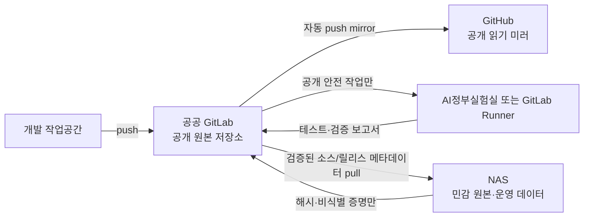

# 공공 GitLab·AI정부실험실 하이브리드 운영 설계

**작성일:** 2026-08-09  
**상태:** 사용자 승인 완료·구현 계획 수립
**대상 저장소:** 교육행정 질문답변 말뭉치·RAG 기반  
**공개 GitLab 경로:** `gitlab.aigov.go.kr/h19h19/education-admin-rag`  
**GitHub 미러:** `github.com/weplebong/education-admin-launcher`

## 1. 결정 요약

공공 GitLab을 공개 개발의 원본 저장소이자 협업·검증 허브로 사용한다. GitHub는 읽기 가능한 자동 미러로 유지한다. NAS는 원본 자료, 검토 데이터, 운영 색인과 백업을 보관하는 비공개 운영 경계로 남긴다.

AI정부실험실 또는 별도 GitLab Runner가 제공되면 코드 빌드, 테스트, 정적 분석, 보안 검사, 컨테이너 빌드 검증과 공개 가능한 합성 데이터 평가를 NAS에서 이전한다. 원본 PDF와 비공개 평가 데이터는 Runner나 공개 GitLab 아티팩트로 전송하지 않는다.

## 2. 확인된 서비스 기능과 제약

2026-08-09 로그인된 공공 GitLab에서 다음을 확인했다.

- 공개 프로젝트, Merge Request, Work Item, Wiki, CI/CD, Releases, Webhook, 프로젝트 액세스 토큰을 지원한다.
- CI 작업 아티팩트와 패키지 레지스트리를 지원한다.
- 현재 확인한 프로젝트에는 프로젝트·그룹·인스턴스 Runner가 없다.
- Container Registry는 비활성이다.
- Auto DevOps가 기본 활성화되어 있으며 지속 배포가 선택되어 있다.
- 공개 프로젝트의 파이프라인 로그와 아티팩트는 공개될 수 있다.
- 기본 Git shallow clone 깊이는 20이다.

따라서 첫 단계에서 Auto DevOps를 끄고 명시적 `.gitlab-ci.yml`만 사용한다. Runner가 준비되기 전 파이프라인은 실행 자원 대기 상태일 수 있으며, 이를 NAS에서 임시 실행하는 방식으로 우회하지 않는다.

## 3. 저장소와 미러 구조

원격 저장소 이름은 다음을 목표로 한다.

- `origin`: 공공 GitLab 원본
- `github`: 기존 GitHub 저장소

미러 우선순위는 GitLab의 push mirror 기능이다. 계정 또는 요금제 제약으로 사용할 수 없으면 보호된 CI 변수에 최소 권한 GitHub 토큰을 저장한 미러 전용 작업을 사용한다. 토큰은 코드, Git 이력, 로그에 기록하지 않는다.

## 4. 공개·비공개 경계

### 4.1 공공 GitLab에 허용

- 소스 코드, 테스트, 합성 fixture
- 설계서, 운영 runbook, 공개 가능한 이슈와 Merge Request
- 테스트 수, 성공·실패 상태, 해시, SBOM, 정적 분석 결과
- 본문과 경로가 없는 평가 집계
- 짧은 보존 기간을 가진 공개 안전 아티팩트
- 태그, Release note, 릴리스 체크섬과 검증 증명

### 4.2 공공 GitLab에 금지

- 원본 PDF와 재배포 권한이 확인되지 않은 자료
- OCR JSONL과 추출 본문
- canonical corpus SQLite, ReviewStore DB, 검토자 작업 파일
- Qdrant 컬렉션·스냅샷, 원본 임베딩, 비공개 평가 문항
- 백업 파일과 암호화 키
- 개인정보, 내부 NAS 경로, 비공개 호스트명·주소
- 현재 유효한 API 키, 토큰, 비밀번호, SSH 개인키

삭제·폐기된 과거 Google API 키 이력은 사용자 확인에 따라 공개 전환 차단 사유로 보지 않는다. 다만 현재 파일과 새 커밋에는 비밀정보가 없어야 하며 secret gate는 계속 실행한다.

## 5. CI/CD 설계

Auto DevOps는 비활성화하고 Runner 종류에 따라 다음 명시적 파이프라인만 둔다.

1. **public-policy**: tracked path가 공개 허용 경계를 넘지 않는지 검사
2. **quality**: `pytest`, Ruff, Ruff format check, strict mypy, `uv lock --check --offline`
3. **security**: current-tree 및 full-history secret 검사
4. **docs**: 설계·runbook과 셸 블록 검증

Docker executor가 검증된 `public-safe-docker` Runner가 생긴 뒤에만 최소 Docker context의 linux/amd64 이미지 빌드와 SBOM·digest 생성을 추가한다. Container Registry에는 push하지 않는다. Release evidence는 민감한 NAS 입력을 public CI가 읽어 생성하지 않는다. NAS에서 서명한 본문 없는 체크섬·검증 메타데이터만 수동으로 GitLab Release에 첨부한다.

공통 정책은 다음과 같다.

- 전체 이력 secret 검사를 위해 `GIT_DEPTH: "0"`을 지정한다.
- 아티팩트는 기본 7일, 릴리스 증명은 Release에 별도 보관한다.
- 로그에 원문·경로·예외 입력값을 출력하지 않는다.
- Fork/MR 파이프라인에는 보호 변수와 NAS 접근 권한을 제공하지 않는다.
- NAS 배포는 자동화하지 않는다. 검증된 릴리스를 NAS가 pull하는 수동 승인 절차를 사용한다.
- Container Registry가 비활성인 동안 이미지는 저장·배포하지 않고 reproducible build 검증만 수행한다.

## 6. NAS 부하 절감 범위

### 6.1 즉시 이전 가능한 작업

Runner가 연결되는 즉시 다음을 NAS에서 제거할 수 있다.

- 전체 단위·통합 테스트
- Ruff, mypy, lock 검증
- secret·공급망·Docker context 검사
- 문서·runbook 검증
- 공개 안전 합성 fixture 기반 파서·검색 회귀
- 컨테이너 이미지 재현 빌드와 SBOM 생성

### 6.2 조건부 이전 가능한 작업

AI정부실험실 VM의 저장공간·네트워크·Runner 등록이 승인되면 다음을 검토한다.

- 공개 모델 캐시 검증과 이미지 빌드
- 공개 또는 합성 데이터 OCR 성능 측정
- 공개 안전 골드셋 기반 검색 평가
- 예약 파이프라인을 통한 주기적 회귀 검사

### 6.3 NAS에 유지할 작업

- 재배포 미확인 원본 PDF의 OCR·추출
- 사람 검토와 개인정보 분류
- canonical corpus 생성·승인
- 운영 Qdrant 적재와 서비스
- 암호화 백업과 격리 복구

NAS는 개발용 테스트 머신이 아니라 민감 데이터 처리와 운영 실행기 역할만 남기는 것이 목표다.

## 7. GitLab 협업 활용

- Work Item과 Milestone으로 배포 준비, Runner 도입, 공개 문서 작업을 추적한다.
- Merge Request에 테스트·보안 결과를 필수 상태로 연결한다.
- 기본 브랜치를 보호하고 직접 push보다 Merge Request를 기본으로 한다.
- Wiki 또는 저장소 문서에서 공개 아키텍처와 설치 가이드를 제공한다.
- Release에 소스 태그, 체크섬, SBOM, 검증 보고서를 묶는다.
- Webhook은 이후 Notion 상태 동기화 또는 NAS의 pull 알림에만 사용하며, NAS 쓰기 권한을 부여하지 않는다.

## 8. 구현 단계

### 단계 A: 공개 프로젝트와 미러

- `education-admin-rag` 공개 프로젝트 생성
- Auto DevOps 비활성화
- 기본 브랜치 보호
- 전체 Git 이력 push
- GitHub push mirror 구성 및 왕복 검증

### 단계 B: 공개 안전 CI

- `.gitlab-ci.yml`과 CI 전용 스크립트 추가
- 공개 로그·아티팩트 경계 테스트
- current-tree/full-history secret gate 연결
- GitLab CI Lint와 로컬 테스트 통과

### 단계 C: Runner와 NAS 부하 이전

- AI정부실험실 VM 또는 전용 Runner 가용성 확인·신청
- 태그가 고정된 보호 Runner로 등록
- 네트워크·디스크·로그 정책 검증
- 공개 안전 작업부터 단계적으로 이전

### 단계 D: 릴리스 운영

- 수동 승인 태그와 Release evidence 생성
- NAS pull·검증 runbook 추가
- 운영 데이터가 GitLab로 역류하지 않는 negative gate 추가

## 9. 완료 기준

- GitLab 프로젝트가 공개이며 GitHub 미러와 동일한 커밋을 가리킨다.
- Auto DevOps가 꺼져 있고 명시적 파이프라인만 존재한다.
- Runner 부재 시에도 프로젝트가 안전하게 대기하며 NAS fallback을 요구하지 않는다.
- 공개 로그·아티팩트에 원문, 개인정보, 비밀, 내부 경로가 없다.
- GitLab CI가 로컬 품질·보안 게이트와 같은 결과를 낸다.
- 원본 PDF, 검토 DB, canonical DB, Qdrant 데이터는 NAS 경계 밖으로 이동하지 않는다.
- Notion 프로젝트 페이지에 현재 상태, 결정, 차단점과 다음 행동이 유지된다.

## 10. 롤백

- 미러 이상 시 GitHub 미러 작업을 중지하고 GitLab 원본만 유지한다.
- CI 정보 노출이 발견되면 파이프라인과 아티팩트를 즉시 중지·만료하고 원인을 고친다.
- Runner 경계가 불명확하면 등록을 해제하고 모든 원격 연산을 공개 합성 작업으로 제한한다.
- NAS 운영 배포는 검증된 이전 release로 되돌리며 GitLab이 NAS에 직접 쓰지 못하게 한다.
