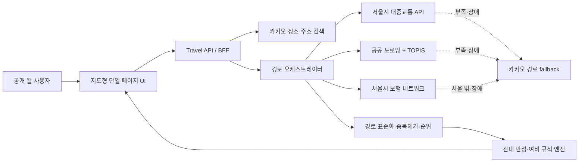

# 강서도서관 관내출장 지도 계산기 설계

- 작성일: 2026-08-10
- 상태: 설계 합의 완료, 작성 명세 사용자 검토 대기
- 대상: 서울특별시교육청 강서도서관 본관·가양관 소속 공무원 및 공개 웹 이용자
- 배포 형태: 로그인 없는 외부 공개 웹앱
- 핵심 목표: 기관과 출장지를 고르면 여러 이동경로의 시간·거리·이동비와 관내출장 예상 지급액을 한 화면에서 확인한다.
- 기존 프로젝트와의 관계: 기존 4MB 단일 HTML 런처 및 승인된 말뭉치/RAG 계획과 분리된 독립 앱이다.

## 1. 결정 요약

1. 출발 기관은 강서도서관 본관과 가양관 중 하나를 선택한다.
2. 출장지는 카카오 장소·주소 검색 또는 지도 클릭으로 선택한다.
3. 지도는 카카오맵을 1차 기본 제공자로 사용한다. 네이버지도는 즉시 함께 구현하지 않고 교체 가능한 후보로만 기록한다.
4. 대중교통·자동차·도보 경로를 모두 조회하고 가능한 경우 수단별 복수 경로를 제공한다.
5. 결과 상단에는 `최단시간`, `최단거리`, `최저비용` 대표 경로를 먼저 표시하고 기본 정렬은 최단시간순으로 한다.
6. 이동경로 비용과 법령상 여비 예상 지급액은 서로 다른 값으로 분리한다.
7. 1만 원·2만 원 판정에는 지도 ETA가 아니라 사용자가 입력한 출장 시작시각과 복귀 예정시각을 사용한다.
8. 서울특별시 안의 목적지는 이동거리와 관계없이 근무지 내 출장으로 본다.
9. 서울 밖 목적지는 기관과 목적지 사이의 일반적인 최단 이동경로 왕복거리가 12km 미만인지 판정한다. 정확히 12km부터는 기본적으로 근무지 외 출장이다.
10. `서울 행정경계 + 외곽 12km`는 지도 검색·자동 계산 지원영역을 빠르게 거르는 공간 필터다. 법령상 12km 산정기준은 아니다.
11. 지원영역 밖은 화면에 `관외출장`을 크게 표시하고 1차 계산을 종료한다. 기관장 판단 예외가 가능하다는 보조 안내를 함께 표시한다.
12. 개인 이름, 직원 명단, 계산 이력, 승인 이력은 1차 버전에서 저장하지 않는다.
13. 공공데이터를 우선 사용하되 공식 데이터가 경로를 완성하지 못하거나 장애가 난 구간은 카카오 경로 API로 보완한다.
14. 결과는 지급 확정액이 아니라 `예상 지급액`이며 적용 규칙, 데이터 출처, 조회시각을 함께 표시한다.

## 2. 제공 문서 검토 결과

사용자가 제공한 `03_최신_여비지침_확인결과_및_Codex_추가지시문.md`는 다음 항목을 잘 다룬다.

- 최신 법령·조례·지침의 우선순위
- 강서도서관 내부지침 미확인 상태
- 제1호·제2호 여비 지급 구분과 이력 관리
- 규칙 버전, 기관별 override, 충돌 경고
- 실제 직원 명단 비저장 원칙

그러나 최초 문서는 전국 국내출장, 직원 마스터, 관리자 기능까지 포함해 핵심 사용 흐름보다 범위가 크다. 이번 1차 버전은 관내출장 지도 계산에 집중하므로 다음 항목을 제외한다.

- 제1호·제2호 직원별 지급 구분: 근무지 내 정액 여비에는 구분이 적용되지 않는다.
- 철도·항공·선박·숙박·식비를 포함한 근무지 외 국내출장 전체 계산
- 직원 Excel 가져오기, 로그인, 관리자 승인, 계산 이력 저장
- 실제 여비 지급 또는 회계 시스템 연동
- 기존 질문답변 말뭉치/RAG 구현 변경

기존 문서에서 위치 기반 흐름에 부족했던 다음 항목은 이 설계에서 구체화한다.

- 기관·출장지 선택 방식
- 지도 지원영역과 법적 거리 판정의 분리
- 이동수단별 복수 경로와 순위
- 경로 데이터 제공자와 fallback
- 이동비와 여비 예상 지급액의 구분
- API 장애·경계값·공용차량·근거리 출장 처리
- 공개 웹의 키 보호, 호출 제한, 캐시와 개인정보 최소화

## 3. 목표와 비목표

### 3.1 목표

- 사용자가 한 화면에서 기관, 출장지, 출장 시작·복귀 시각을 입력한다.
- 서울 및 서울 인접 지원영역에서 대중교통·자동차·도보 경로를 비교한다.
- 여러 경로 중 최단시간·최단거리·최저비용을 즉시 식별한다.
- 관내·관외 판정에 사용한 거리와 경로를 사용자가 확인할 수 있다.
- 법령상 명확한 관내출장 예상 지급액을 자동 계산한다.
- 자동 확정할 수 없는 경우 금액을 꾸며내지 않고 검토 사유를 보여준다.
- 공공데이터 우선, 공급자 교체 가능, 규칙 버전형 구조를 갖는다.
- 외부 공개 서비스에 필요한 최소 보안·호출제어·장애대응을 제공한다.

### 3.2 비목표

- 내비게이션 수준의 음성 안내와 턴바이턴 주행 안내
- 직원 인증, 개인별 출장 기록, 결재·정산·증빙 보관
- 관외출장 여비, 국외출장 여비, 숙박비·식비 전체 계산
- 자동차 연료비를 법정 지급액으로 자동 인정하는 기능
- 주차 가능 여부 또는 실제 주차요금 보장
- 직원별 제1호·제2호 지급 구분 관리
- AI가 법적 판단을 대신하는 기능

## 4. 공식 근거와 규칙 상태

### 4.1 기본 근거

| 우선순위 | 문서 | 적용 상태 |
|---:|---|---|
| 1 | [공무원 여비 규정](https://www.law.go.kr/LSW/lsInfoP.do?lsiSeq=287535), 시행 2026-07-01, 대통령령 제36492호 | 제18조 핵심 규칙 적용 |
| 2 | [서울특별시교육감 소속 공무원의 여비 조례](https://www.law.go.kr/LSW/ordinInfoP.do?ordinSeq=2099835), 시행 2026-01-08, 서울특별시조례 제9914호 | 교육감 소속 공무원 적용 연결 |
| 3 | [공무원보수 등의 업무지침](https://www.mpm.go.kr/mpm/info/resultPay/payBoard/?boardId=bbs_0000000000000035&category=%EB%B3%B4%EC%88%98&cntId=693&mode=view), 시행 2026-07-01, 인사혁신처예규 제216호 | 거리·근거리·동일일·차량 세부처리 |
| 4 | 서울특별시교육청 2026년도 예산편성 기본지침 | 공식 출처 등록, 상위 규칙과 충돌하지 않는 범위에서 참고 |
| 5 | 강서도서관 내부 세부지침 | `LOCAL_POLICY_UNVERIFIED` |

강서도서관 자체 지침이 확인되면 하위 규칙 파일을 추가한다. 하위 기준이 상위 규정과 충돌하면 자동 적용하지 않고 `RULE_CONFLICT`로 표시한다.

### 4.2 근무지 내·외 판정

출발지는 선택한 기관의 공식 주소와 검증된 좌표다.

- 본관: 서울특별시 강서구 등촌로51나길 29
- 가양관: 서울특별시 강서구 양천로55길 46

판정 순서는 다음과 같다.

1. 목적지 좌표가 서울특별시 행정경계 안이면 `LOCAL`이다.
2. 목적지가 `서울 경계 + 외곽 12km 지원영역` 밖이면 `OUT_OF_COVERAGE`로 처리하고 화면에는 `관외출장`을 표시한다.
3. 목적지가 서울 밖이지만 지원영역 안이면 판정용 왕복거리를 계산한다.
4. 판정용 왕복거리란 일반적인 최단 네트워크 경로의 `기관→출장지 거리 + 출장지→기관 거리`다. 일방통행 때문에 단순히 편도 거리의 두 배로 계산하지 않는다.
5. 판정용 왕복거리 `< 12,000m`이면 `LOCAL`, `>= 12,000m`이면 `NON_LOCAL_EXPECTED`다.
6. 화면에서 사용자가 선택한 빠른 길·싼 길 또는 정렬 탭은 판정용 거리를 바꾸지 않는다.
7. 서울 밖 12km 이상도 교통여건과 기관장 판단에 따른 예외가 있을 수 있으므로 결과 하단에 `기관 판단 예외 가능`을 표시한다.

서울 경계 버퍼는 서비스의 검색·호출 범위를 제한하는 보수적 사전 필터다. 버퍼 자체를 법적 거리로 설명하거나 지도상 직선거리로 12km를 판정하지 않는다.

### 4.3 예상 지급액

`durationMinutes = 복귀 예정시각 - 출장 시작시각`으로 계산한다. 자정을 넘는 입력은 출장일·복귀일을 함께 받아 계산한다. 점심시간이 포함돼도 자동 공제하지 않는다.

| 조건 | 기본 예상액 |
|---|---:|
| 4시간 미만 | 10,000원 |
| 4시간 이상 | 20,000원 |
| 전용차량 배정자 | 0원 |
| 공무용·준공용·임차 차량 이용 | 기본액에서 10,000원 감액 |

추가 분기는 다음과 같다.

- 왕복거리 `<= 2,000m`는 정액 지급이 아니라 증빙된 실비 대상이다.
- 4시간 미만 근거리 출장은 운임만, 총 10,000원 상한이다.
- 4시간 이상 근거리 출장은 운임과 식비 1/3만, 총 20,000원 상한이다.
- 근거리 실비는 경로 예상비만으로 확정하지 않고 `REVIEW_REQUIRED`와 증빙 안내를 표시한다.
- 동일일 다수출장은 로그인 없는 1차 앱이 이전 계산을 알 수 없으므로 사용자가 `오늘 다른 관내출장 있음`을 선택하면 이전 지급 예상액을 입력받는다.
- 현행 지침에서 자동 상한이 명확한 조합은 적용하고, 그 밖의 동일일 조합은 `LOCAL_POLICY_UNVERIFIED`로 담당자 확인을 안내한다.
- 기관장의 적법한 감액 가능성이 있으므로 모든 자동 결과는 `예상 지급액`이다.

## 5. 핵심 사용자 흐름

1. 사용자가 `본관` 또는 `가양관`을 고른다.
2. 카카오 장소검색에서 출장지를 선택하거나 지도에서 지점을 누른다.
3. 출장 시작시각과 복귀 예정시각을 입력한다.
4. 공용차량·전용차량 여부와 동일일 다른 출장 여부를 선택한다.
5. 서버가 지원영역을 확인하고 세 이동수단 경로를 병렬 조회한다.
6. 경로를 공통 형식으로 변환하고 중복을 제거한다.
7. 최단시간·최단거리·최저비용 대표 경로를 선정한다.
8. 판정용 거리를 별도로 계산해 관내·관외를 판정한다.
9. 출장 예정시간과 차량·근거리·동일일 조건으로 예상 지급액을 계산한다.
10. 지도, 대표 경로 3개, 전체 대안, 판정 이유, 이동비, 예상 지급액, 출처와 조회시각을 한 화면에 표시한다.

## 6. 화면 설계

### 6.1 상단 입력 영역

- 기관 선택: 본관 / 가양관
- 출장지 검색: 장소명 또는 도로명 주소
- 지도 클릭 지점의 주소 역검색
- 출장 시작일시와 복귀 예정일시
- 차량 구분: 이용 안 함 / 자가용 / 공무용·준공용·임차 / 전용차량 배정자
- 동일일 다른 관내출장: 없음 / 있음
- `경로 계산` 버튼

검색 결과는 장소명, 도로명 주소, 지번 주소를 함께 표시한다. 동명이거나 주소가 불명확하면 사용자가 정확한 결과를 선택하기 전까지 계산하지 않는다.

### 6.2 지도 영역

- 기관과 출장지 마커
- 선택된 경로를 굵게, 다른 후보를 옅게 표시
- 최단시간·최단거리·최저비용 경로의 색상 범례
- 서울 경계와 외곽 지원영역은 필요할 때만 켤 수 있는 보조 레이어
- 판정용 경로는 일반 경로와 구분된 점선으로 표시
- 모바일에서는 결과 카드 아래에 지도를 배치하거나 접을 수 있게 한다.

### 6.3 결과 영역

상단 요약은 다음 순서다.

1. 관내출장 / 관외출장 / 검토 필요
2. 출장 예정시간
3. 예상 지급액
4. 최단시간·최단거리·최저비용 대표 카드
5. `최단시간순`, `최단거리순`, `최저비용순` 정렬 탭
6. 전체 경로 목록
7. 판정용 거리와 규칙 근거
8. 데이터 출처·조회시각·비용 가정·경고

같은 경로가 두 개 이상의 대표 조건을 만족할 수 있다. 해당 카드는 중복 생성하지 않고 여러 배지를 표시한다.

## 7. 전체 아키텍처



로그인이 없어도 REST 키 보호, HTTP 공공 API 중계, 호출 제한과 캐시를 위해 백엔드는 필수다. 카카오 JavaScript 키는 등록 도메인 제한을 전제로 브라우저에서 사용하고, 카카오 REST 키와 공공데이터 키는 서버 환경변수에만 둔다.

## 8. 컴포넌트 경계

### 8.1 공개 웹 UI

- 입력 상태와 접근성 있는 폼을 관리한다.
- 카카오맵을 렌더링하고 서버가 반환한 GeoJSON 경로를 표시한다.
- 자체적으로 법적 판정이나 지급액을 계산하지 않는다.
- `mobilityCost`와 `allowance`를 다른 제목·색상으로 표시한다.

### 8.2 Travel API / BFF

- 입력 형식, 날짜, 좌표와 지원영역을 검증한다.
- 장소검색과 경로 제공자 키를 보호한다.
- 제공자 호출 timeout, 동시성, 캐시, 호출 제한을 관리한다.
- 경로와 정책 결과를 단일 응답으로 조립한다.

### 8.3 경로 오케스트레이터

- 대중교통·자동차·도보 제공자를 동시에 호출한다.
- 제공자별 응답을 `RouteOption`으로 정규화한다.
- 동일하거나 거의 같은 경로를 중복 제거한다.
- 안정적인 동점 규칙으로 대표 경로를 선정한다.
- 제공자 실패를 다른 수단의 0분·0원 경로로 바꾸지 않는다.

### 8.4 정책 엔진

- 지도 지원영역과 법적 거리 판정을 분리한다.
- 출장일 기준 규칙 버전을 선택한다.
- 2km·12km·4시간·차량·동일일 조건을 계산한다.
- `ruleSetId`, 시행일, 근거 링크, 미확인 기관 정책을 결과에 포함한다.

### 8.5 규칙·공간 리소스

- 본관·가양관 주소와 검증 좌표
- 서울 행정경계 GeoJSON
- 서울 외곽 지원영역 GeoJSON
- 공간자료 출처·생성일·해시 manifest
- 시행일별 관내출장 규칙
- 데이터 출처 register

## 9. 데이터 제공 전략

| 기능 | 1차 제공자 | 보완 제공자 | 주의사항 |
|---|---|---|---|
| 지도 표시·마커·경로선 | [카카오 지도 Web API](https://apis.map.kakao.com/web/guide/) | 네이버지도는 후속 교체 후보 | JavaScript 키 도메인 제한 |
| 장소·주소 검색 | [카카오 Local API](https://developers.kakao.com/docs/latest/ko/local/dev-guide) | 지도 클릭 좌표 역검색 | REST 키 서버 전용 |
| 대중교통 | [서울시 대중교통환승 경로 API](https://data.seoul.go.kr/dataList/OA-15352/L/1/datasetView.do) | 카카오 대중교통 경로 | 공공 API의 복수경로·요금·폴리라인 필드를 사전 실증 |
| 자동차 | 국가 표준 노드·링크 + [서울 TOPIS](https://topis.seoul.go.kr/refRoom/openRefRoom_4.do) | 카카오 자동차 길찾기 | 이면도로·서울 밖 속도 누락은 예상치 표시 |
| 도보 | 서울시 보행 네트워크 | 서울 밖 및 누락 구간 카카오 도보 | 외곽 12km의 완전한 공공 보행망 부재 |
| 서울 경계 | 국가·서울시 공공 공간데이터 | 없음 | 버전·해시 고정 |
| 자동차 유가 | [한국석유공사 오피넷](https://www.opinet.co.kr/user/custapi/custApiInfo.do) | 마지막 정상값 | 조회일과 유종 표시 |

공공 API가 실제로 반환하는 경로 개수, 요금, 단계별 좌표와 HTTPS 중계 가능성은 구현 전 실증 게이트에서 확인한다. 필수 필드가 없으면 해당 필드만 카카오로 보완하며 출처를 경로별로 표시한다.

## 10. 경로·결과 데이터 계약

### 10.1 요청

```json
{
  "institutionId": "GANGSEO_MAIN",
  "destination": {
    "name": "서울특별시청",
    "address": "서울특별시 중구 세종대로 110",
    "latitude": 37.5662952,
    "longitude": 126.9779451
  },
  "startsAt": "2026-08-10T09:00:00+09:00",
  "returnsAt": "2026-08-10T14:30:00+09:00",
  "vehicleUse": "NONE",
  "hasOtherLocalTripsToday": false,
  "previousAllowanceKrw": 0
}
```

`vehicleUse`는 `NONE`, `PRIVATE`, `OFFICIAL_OR_RENTED`, `ASSIGNED_OFFICIAL` 중 하나다.

### 10.2 정규 경로

```json
{
  "id": "route-transit-001",
  "mode": "TRANSIT",
  "durationSeconds": 2820,
  "distanceMeters": 14600,
  "mobilityCostKrw": 1550,
  "costStatus": "KNOWN",
  "geometry": { "type": "LineString", "coordinates": [] },
  "source": "SEOUL_TRANSIT",
  "sourceAsOf": "2026-08-10T09:01:12+09:00",
  "warnings": []
}
```

`mode`는 `TRANSIT`, `CAR`, `WALK` 중 하나다. `costStatus`는 `KNOWN`, `ESTIMATED`, `UNKNOWN` 중 하나다.

### 10.3 결과

결과는 다음을 독립 객체로 반환한다.

- `coverage`: 지원영역 안팎
- `classification`: `LOCAL`, `NON_LOCAL_EXPECTED`, `REVIEW_REQUIRED`
- `classificationDistanceMeters`와 판정용 경로 ID
- `routes[]`
- `best.fastestRouteId`
- `best.shortestRouteId`
- `best.cheapestRouteId`
- `mobilityCost`: 사용자가 선택한 경로의 이동비 예상
- `allowance`: 법령상 예상 지급액·상한·검토 상태
- `ruleSetId`, `effectiveFrom`, `sourceRefs`
- `warnings[]`

## 11. 복수 경로 순위

- 기본 화면은 `durationSeconds` 오름차순이다.
- 최단거리는 `distanceMeters` 오름차순이다.
- 최저비용은 `costStatus != UNKNOWN`인 경로만 `mobilityCostKrw` 오름차순으로 비교한다.
- 동률이면 시간, 거리, 제공자 우선순위, 안정적인 경로 ID 순서로 결정한다.
- 도보 0원은 실제 최저비용으로 표시하되 예상 소요시간을 같은 크기로 보여준다.
- 대중교통 비용은 경로 API의 요금을 사용하고 출처를 표시한다.
- 자동차 비용은 `거리 ÷ 기준연비 × 조회 유가 + 통행료 + 사용자가 입력한 주차비`의 예상치다.
- 기준연비, 유종, 유가 조회일과 주차비 포함 여부를 결과에 표시한다.
- 자동차 예상 이동비는 관내출장 정액 여비와 같다고 설명하지 않는다.

## 12. 오류 처리와 결과 상태

| 상태 | 처리 |
|---|---|
| `CALCULATED` | 명확한 규칙과 유효한 경로로 예상액 표시 |
| `REVIEW_REQUIRED` | 근거리 실비, 내부기준 미확인, 거리·제공자 불일치 등 사유 표시 |
| `OUT_OF_COVERAGE` | 관외출장 표시 후 1차 자동 계산 종료 |
| `ROUTE_PARTIAL` | 성공한 이동수단만 표시하고 실패 수단 사유 안내 |
| `DATA_UNAVAILABLE` | 관내 판정 또는 금액을 추정하지 않고 재시도 안내 |
| `RULE_CONFLICT` | 상·하위 규칙 충돌 내용을 표시하고 자동 확정 금지 |

세부 원칙은 다음과 같다.

- 장소검색 결과를 선택하지 않은 자유 텍스트로 계산하지 않는다.
- 12km 판정에 필요한 왕복 경로가 없으면 직선거리로 대체하지 않는다.
- 제공자가 0 또는 빈 값을 반환하면 실제 0인지 누락인지 스키마 검증 후 처리한다.
- 자동차·대중교통의 시간 민감 캐시는 짧게, 장소와 도보 경로 캐시는 길게 둔다.
- 캐시 결과에는 원본 조회시각을 유지한다.
- timeout, 회로차단, 제한된 재시도를 사용해 한 제공자 장애가 전체 화면을 멈추지 않게 한다.
- 공공·민간 API 쿼터가 소진되면 `503`과 명시적 공급자 경고를 반환한다.

## 13. 공개 서비스 보안·개인정보

- 로그인과 사용자 식별 쿠키를 만들지 않는다.
- 직원명, 출장 목적, 개인 연락처를 입력받지 않는다.
- 장소검색 원문과 정밀 좌표를 애플리케이션 로그에 남기지 않는다.
- 카카오 JavaScript 키는 허용 도메인을 제한한다.
- 카카오 REST 키와 공공데이터 키는 서버 환경변수에만 둔다.
- 허용 origin·host를 정확히 제한한다.
- 검색어 길이, 좌표 범위, 날짜 간격과 요청 본문 크기를 검증한다.
- IP별 API 호출 제한과 `429 Retry-After`를 제공한다.
- 신뢰한 reverse proxy에서만 전달 IP 헤더를 인정한다.
- 외부 제공자 응답을 HTML로 직접 삽입하지 않고 스키마 검증·escape 후 표시한다.

## 14. 캐시와 운영

1차 단일 인스턴스는 TTL/LRU 메모리 캐시로 충분하다.

- 기관·규칙·경계: 배포 버전 동안 고정
- 장소검색: 검색어·영역 기반 중간 TTL
- 도보 경로: 장기 TTL
- 자동차·대중교통: 출발시각 bucket을 포함한 짧은 TTL
- 유가: 일 단위 캐시

수평 확장 전에는 Redis·데이터베이스를 추가하지 않는다. 다중 인스턴스가 필요해질 때 공유 캐시와 분산 호출 제한을 별도 설계한다.

운영 상태에는 제공자별 성공률, timeout, 캐시 적중률, 쿼터 소진율만 기록하고 사용자 목적지 원문은 기록하지 않는다.

## 15. 검증 전략

### 15.1 규칙 단위 테스트

- 서울 안의 먼 목적지는 거리와 관계없이 관내
- 서울 밖 왕복 11,999m는 관내
- 서울 밖 왕복 12,000m는 관외 예상
- 출장 239분은 10,000원
- 출장 240분은 20,000원
- 왕복 2,000m는 근거리 실비 분기
- 공용차량: 4시간 미만 0원, 4시간 이상 10,000원
- 전용차량 배정자 0원
- 날짜별 규칙 버전 선택
- 화면에서 선택한 경로가 판정용 거리를 바꾸지 않음

### 15.2 경로 서비스 테스트

- 저장된 제공자 fixture로 응답 정규화
- 복수 경로 중복 제거
- 최단시간·최단거리·최저비용 선정
- 같은 경로가 여러 대표 배지를 갖는 경우
- 비용 미상 경로의 최저비용 제외
- 제공자 timeout·빈 응답·잘못된 좌표·쿼터 소진
- 일부 이동수단만 성공한 부분 결과

### 15.3 API·보안 테스트

- REST 키와 공공데이터 키가 bootstrap·오류·정적 파일에 노출되지 않음
- 좌표·날짜·입력 길이 검증
- 캐시 적중과 만료
- IP별 429와 `Retry-After`
- 허용되지 않은 host·origin 차단

### 15.4 브라우저 E2E

mock 제공자로 다음 핵심 흐름을 검증한다.

1. 기관과 출장지 선택
2. 시작·복귀 시각 입력
3. 복수 경로 표시
4. 대표 3개 카드와 정렬 전환
5. 지도 경로 선택
6. 관내 판정과 예상 지급액 표시
7. 이동비와 여비의 구분
8. 제공자 일부 장애 안내

### 15.5 공식 데이터 실증 게이트

구현 시작 시 실제 키로 소규모 opt-in 검증을 먼저 수행한다.

- 서울 대중교통 API가 복수 경로, 총시간, 총거리, 요금, 단계별 좌표 중 무엇을 반환하는지 확인
- 카카오 장소검색 도메인·REST 키 제한 확인
- 본관·가양관과 대표 출장지 30곳의 경로 비교
- 서울 경계 인접 목적지의 왕복거리 재현성 확인
- 공공 자동차·도보망의 누락 구간과 카카오 fallback 비율 측정

실증 결과가 필수 계약을 충족하지 않으면 제공자 adapter만 바꾸며 UI·정책 계약은 유지한다.

## 16. 저장소와 배포 경계

새 앱은 `apps/travel-map/` 아래 독립 배포 단위로 둔다. 기존 루트의 단일 HTML, RAG `src/`, `data/`, `tests/`, `pyproject.toml` 계획과 경로를 공유하지 않는다.

권장 경계는 다음과 같다.

```text
apps/travel-map/
├── app/                  # FastAPI, 정책·경로 조립, 정적 UI
├── app/providers/        # 카카오·서울 교통·도로·도보 adapter
├── app/static/           # 지도형 HTML/CSS/ES modules
├── resources/
│   ├── institutions.json
│   ├── geodata/
│   └── rules/
├── tests/
├── e2e/
├── Dockerfile
├── pyproject.toml
└── README.md
```

1차는 FastAPI와 브라우저 표준 ES modules를 사용한다. React, 사용자 DB, 관리자 화면, Redis, RAG 연동은 도입하지 않는다.

## 17. 구현 단계 분리

전체 목표는 세 개의 독립 검토 단위로 나눈다.

### 단계 A: 계산기 기반과 실사용 가능한 공개 MVP

- 독립 앱 scaffold와 공개 안전장치
- 카카오맵·장소검색
- 서울 경계·기관·버전형 여비 정책
- 공통 경로 계약, 복수 경로 UI와 대표 3개 순위
- 서울 대중교통 API 우선 연결
- 단계 B·C가 배포되기 전 자동차·도보는 카카오 경로 API를 명시적 fallback으로 사용해 기능을 완성
- 오프라인 fixture 테스트와 공개 배포 가능한 Docker 이미지

### 단계 B: 공공 자동차 경로 엔진

- 국가 표준 노드·링크와 TOPIS 연결
- 최단시간·최단거리·예상비용 경로
- 서울 밖 지원영역의 기준속도 보완
- 카카오 결과와 골드 경로 비교 후 기본 제공자로 승격

### 단계 C: 공공 도보 경로 엔진

- 서울시 보행 네트워크 수집·검증
- 횡단보도·육교·터널·통행 가능성 반영
- 서울 밖 누락 구간 fallback
- 접근 불가능 경로와 데이터 단절 감지

각 단계는 단독으로 실행·테스트 가능해야 한다. 단계 A가 먼저 사용자 목표를 충족하며, 단계 B·C는 공급자 종속성과 공공데이터 비중을 개선한다.

## 18. 출시 기준

- 본관·가양관 주소와 좌표를 공식 페이지·카카오맵에서 이중 확인했다.
- 서울 경계와 지원영역 manifest에 출처, 생성일, 해시가 있다.
- 2km·12km·4시간·차량 규칙 경계 테스트가 모두 통과한다.
- 대표 출장지 30곳에서 관내 판정과 경로 표시를 사람이 검토했다.
- 세 이동수단 중 제공 가능한 경로를 복수 카드로 표시한다.
- 최단시간·최단거리·최저비용 대표 경로가 안정적으로 재현된다.
- 이동비와 예상 지급액이 명확히 분리돼 있다.
- API 키가 정적 파일·응답·오류 로그에 노출되지 않는다.
- 제공자 장애·쿼터 소진·부분 실패 화면이 검증됐다.
- 공식 근거와 `LOCAL_POLICY_UNVERIFIED` 항목이 화면과 문서에 표시된다.
- 모든 금액 결과가 `예상 지급액`으로 표현된다.

## 19. 내부 확인이 남은 항목

다음 항목은 구현을 막지 않지만 자동 확정 범위를 제한한다.

- 강서도서관이 12km 판정에 실제 사용하는 지도·경로 옵션
- 동일일 4시간 미만 출장 여러 건의 상한 처리
- 공무용차량으로 보는 차량의 기관별 범위
- 왕복 2km 이내 실비의 허용 증빙과 처리 사례
- 기관장 판단으로 서울 밖 12km 이상을 관내 처리한 사례

확인 전에는 코드에 임의 하드코딩하지 않고 규칙 상태와 안내 문구로 관리한다.
